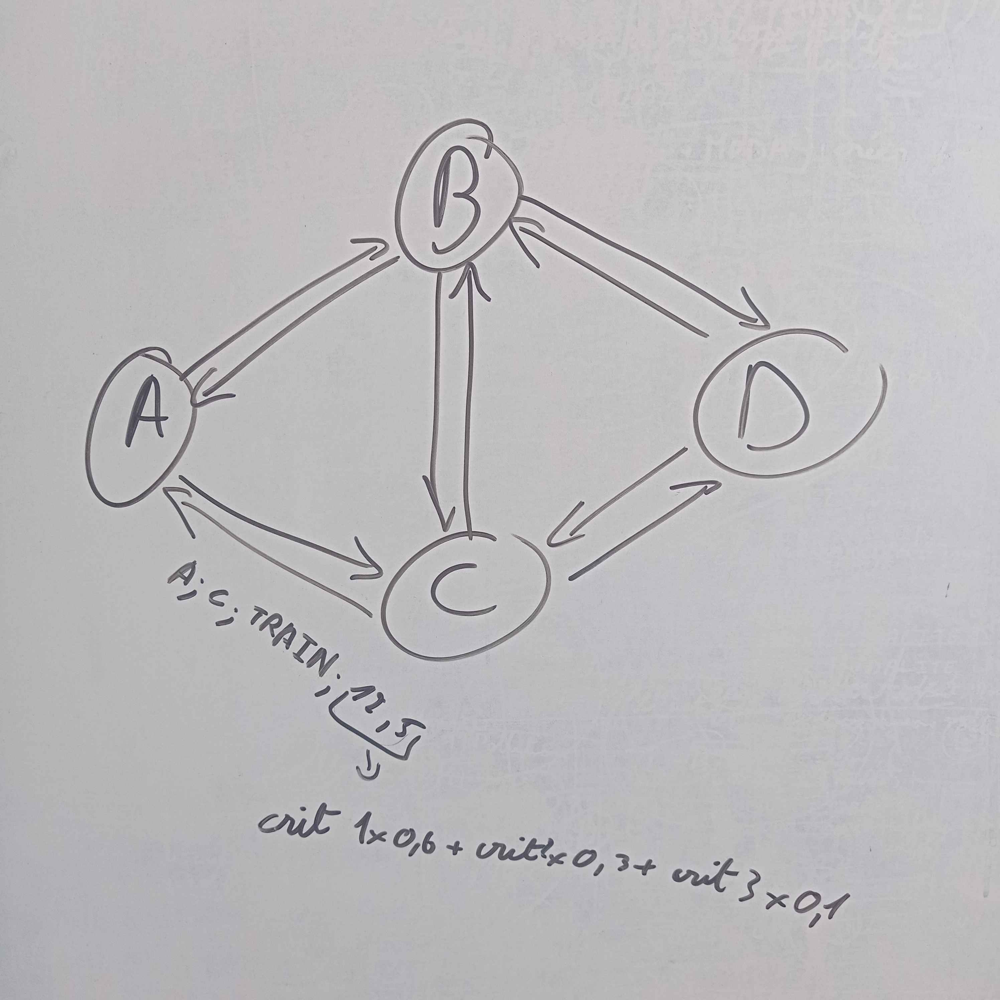

# V1
Dans cette première partie de graphe nous devions:
- Modélisatier le problème pour la Version 1
- Utiliser la bibliothèque fournie pour calculer les voyages optimaux

Le calcul des voyages optimaux c'est fait à l'aide de l'AlgorithmeKPCC pour lequel il fallait fournir le graphe, le départ et l'arrivé du chemin.

    

# V2
Dans cette deuxième partie de graphe nous devions:
- Prendre en compte le coûts des correspondances

La difficulté dans celui ci était que le graphe avait 3 types de coût celon ce que voulait l'utilisateur. Il nous fallait donc inventer un système pouvant facilement faire ça.

- Implémenter un scénario illustrant le bon fonctionnement du système

# V3
Dans cette dernière partie de graphe nous devions:
- Exprimer des préférences multi-critères

Nous devions pour cela mixer ceci avec de la POO, nous avions donc crée un système de ratio, l'utilisateur disait l'ordre des critères les plus importants. Grâce à ça nous parcourons le graphe et calculons le ratio de chaque branche pour pouvoir donner une valeur à celle-ci.

- Implémentation d’un jeu de données et d’un scénario pour illustrer le bon fonctionnement de votre application