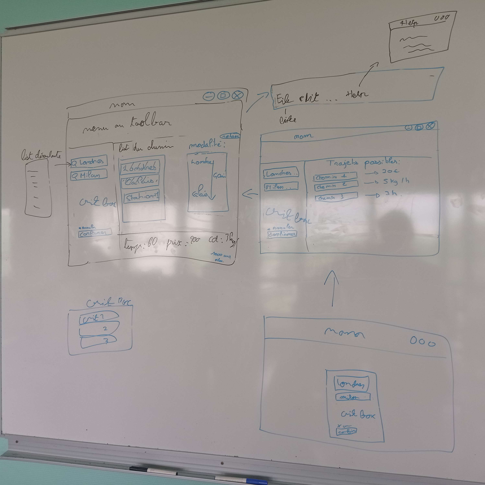
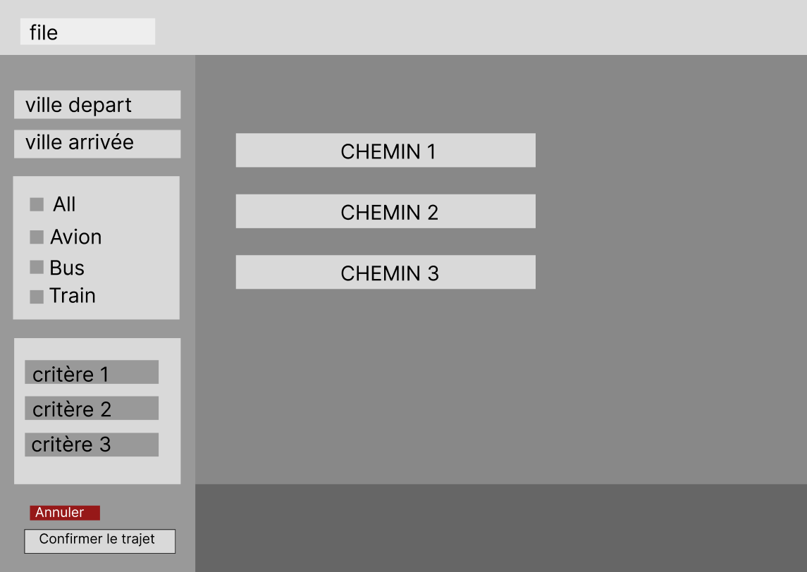

# V2
La première partie est de crée une interface est identifié les besoins que l'on a, nous avions donc:
- Demander un trajet de A à B
- Proposer des critères de sélection
- Proposer des modalités différentes

Grâce à ces informations fournis par l'utilisateur nous devions lui donner:
- Un trajet par étape selon les critères de l'utilisateur

Nous avons donc fait une première maquette:

    

L'idée était crée, nous avons donc pu avancé sur la V3

# V3
Il nous fallait ici un prototype haute fidélité, nous avons donc refait une maquette mais sur figma, un site fait pour cela.

    

Ceci est la maquette depuis laquel nous avons donc fait la deuxième chose demander dans la V3: La réalisation d'une interface javaFX.