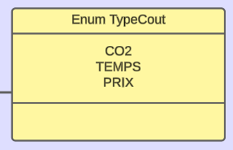
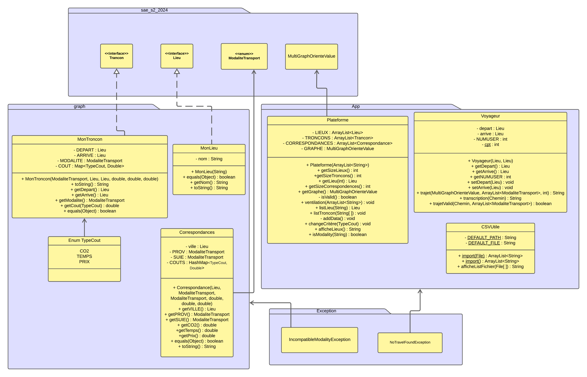
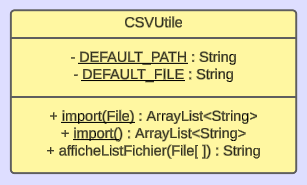
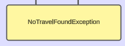
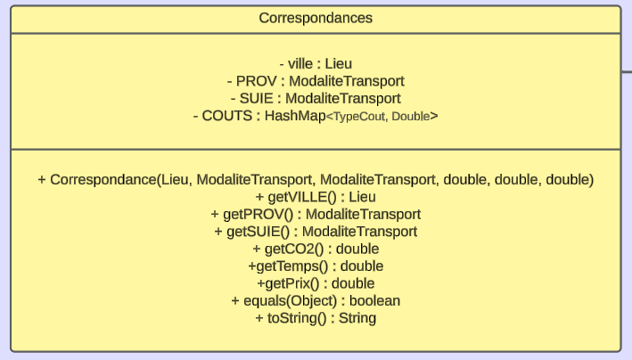
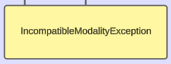
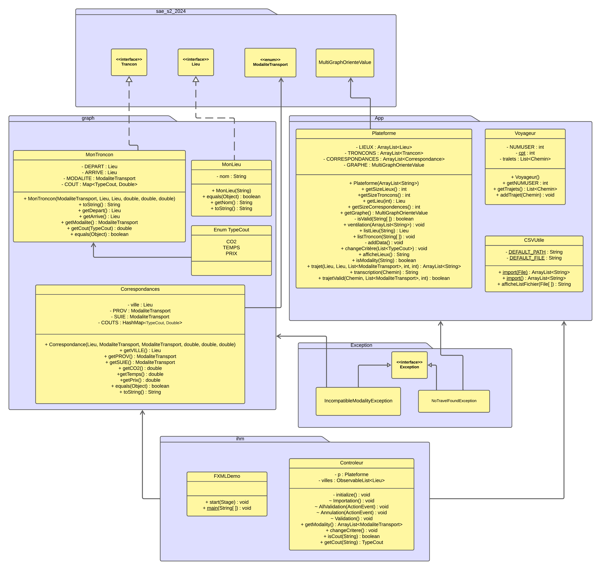
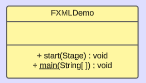
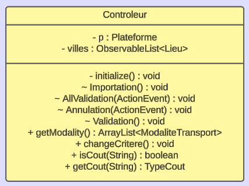

# SAÉ 201-202 dev d'une application et exploration algorithmique

## V1

La première version de cette application doit répondre aux éxigences suivante :
- Récupération des données.
- Vérification des données.
- Calculer les meilleurs voyages possible.
- Exclure les voyages qui dépasse la limite donner par l'utilisateur.

Grace au 2 package suivant nous avons pus satisfaire ces éxigences.

Voici le diagrame UML de cette application pour la V1.

### Package App V1

#### Plateforme.java

La classe principale du projet, regroupant tout les paramètres importants et utiles à la constitution du graphe.
   
#### Voyageur.java

Un voyageur est identifiable via un numéro automatique,
il a un lieu de départ et un lieu d'arrivé pour décrire son trajet "favorie".  
Nous pouvons redéfinir ces lieux en fonction du besoin de l'utilisateur.

### Package graph V1

#### MonLieu.java

La class MonLieu est l'implémentation de l'interface Lieu venant de la librérie **sae_s2_2024.jar**.
Un Lieu est constitué que d'un nom qui n'est pas senser changé.

La methode *equals()* ce base sur le nom pour comparé 2 villes.

La methode *toString()* nous renvoie l'affichage tel que : < Modalité > --> < depart >,< arrivé >

#### MonTroncon.java

La class MonTroncon est l'implémentation de l'interface Trancon venant de la librérie **sae_s2_2024.jar**.
Un Troncon est constitué d'un Lieu de départ, un Lieu d'arrivé, d'une Moadalité de Transport et d'une table associative des types de coûts avec leurs valeurs passer en paramètre lors de ça création.  
Les lieux ainsi que la modalité sont des constantes. Si un troncon doit être changer par sa modalité ou son lieu (départ ou arrivé) il devra être supprimé initialement et ré-instancié.

La methode *toString()* nous renvoie l'affichage tel que : < Modalité > --> < depart >,< arrivé >

#### TypeCout.java 

Cette énumeration défini les critères, les poids d'un certain type pour un tronçon.
Ainsi nous pouvons selectionné un chemin en les ayant trié par ce critère.  
Les 3 types de critères présents sont :
- Pollution
- Temps
- Prix

## V2

Le diagram UML de la V2.

### Package App V2

#### CSVUtil.java

Cette classe a pour unique but de gérer toute actions liées aux fichiers, à savoir le chargement des fichiers via les methodes *"importCSV()"* et *"importCSV(File)"*

La methode *"afficheListFile(File[])"* prend en paramètre un tableau de *File*, provenant du main elle doit simplement afficher tout les fichiers disponible dans un répertoir prédéfinie.  
Ce répertoir est le **res** puis le sous répertoir **Data** dans ce dépot git.

La méthode *"importCSV(File file)*" prend un fichier en paramêtre et renvoit celui si sous en type String, Si le fichier est mauvais ou si il y a une erreur avec le fichier une erreur sera renvoyer.

#### App Exception

La class *NoTravelFoundException* est une class d'exception, l'exception est soulever par la methode *trajet()* de la class Voyageur lorsque aucun voyage n'est possible.

### Package graph V2

#### Class Correspondance.java

La class correspondance illustre une correspondance entre deux modalité.

#### graph Exception

La class *IncompatibleModalityException* est une class d'exception, l'exception est soulever par le constructeur de la class Correspondance lorsque les deux modalité passer en paramètre sont les mêmes.

## V3

Le diagram UML pour cette V3.

Vous pouvez aussi retrouver le diagram UML réaliser sur le site de LucidChart (a condition d'avoir un compte) avec ce [lien](https://lucid.app/lucidchart/d344f6c7-c5b0-4d8d-b7c6-84bda1fe0ff2/edit?invitationId=inv_97244040-35ec-411f-a1d7-6d3a6638ade9&page=0_0#)

### Package ihm V3

#### Class FXMLDemo.java

La class FXMLDemo contient le *main* et la methode *start(Stage)* pour utiliser le fichier .fxml générer grace a SceneBuilder.

#### Class Controleur.java

La class Controleur contient les methodes pour intéragir avec l'application et nous permettre d'utiliser la class Plateforme avec une interface graphique.